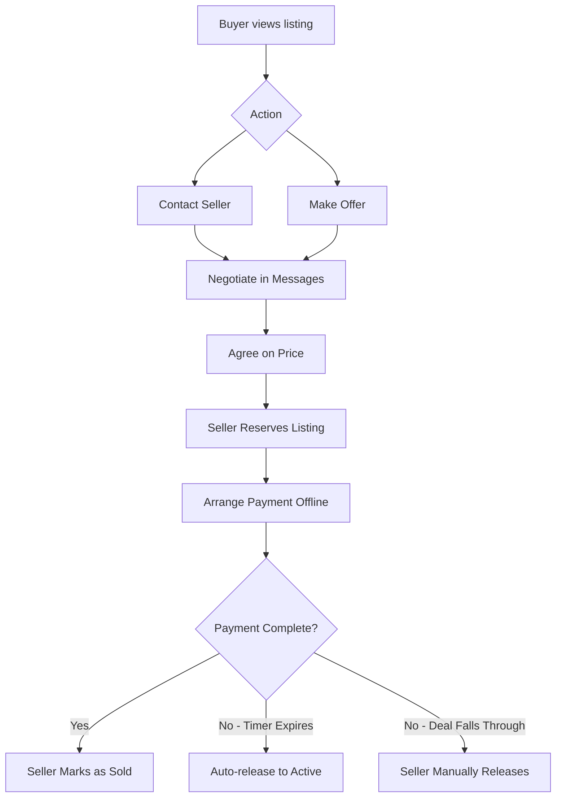

# MotorSauce: Classifieds Model Transition

## Business Model Change

**Previous Model:** Payment-processing marketplace with integrated checkout (similar to eBay/marketplace)  
**New Model:** Classifieds platform where buyers and sellers connect directly (similar to Gumtree/Craigslist)  
**Future Vision:** Gradual transition to escrow-based payment system over 3 years

---

## Current Payment Infrastructure Analysis

### Files to Remove (8 files)
```
✗ src/app/basket/page.tsx                  - Shopping basket UI
✗ src/app/basket/add/page.tsx              - Add to cart flow
✗ src/app/checkout/page.tsx                - Checkout with address/payment
✗ src/app/checkout/success/page.tsx        - Order confirmation
✗ src/app/api/checkout/session/route.ts    - Stripe integration
✗ src/components/CartDrawer.tsx            - Cart sidebar
✗ src/components/StickyBuyBar.tsx          - Mobile buy bar
✗ src/lib/cartStore.ts                     - Cart state management
```

### Files to Modify (3 files)
```
⚠ src/app/listing/[id]/page.tsx
  - Lines 326-355: Remove "Buy now" and "Add to basket" buttons
  - Keep: "Make an Offer", "Contact Seller", "Report Listing"
  
⚠ src/components/ListingActions.tsx
  - Lines 91-94: Remove "Buy now" button with shopping cart icon
  - Keep: "Make an offer", "Message seller", "Share", "Report"
  
⚠ src/components/Header.tsx
  - Remove basket icon/link from navigation
  - Keep: Messages, Offers, Profile, Search
```

### API Endpoints (Check if used)
```
? /api/orders/route.ts - Order creation endpoint
? /api/orders/[id]/cancel/route.ts - Order cancellation
```

### Database Tables (Check & Preserve)
- `orders` - Keep for future escrow system
- `order_items` - Keep for future
- Cart storage uses localStorage (no DB table)

---

## New Classifieds Workflow

### 1. Buyer Journey
```
1. Browse listings → View details
2. Contact Seller (opens message thread)
   OR Make an Offer (negotiates price)
3. Agree on terms via messaging
4. Seller marks listing as "Reserved" (24-48 hour hold)
5. Arrange payment directly:
   - Bank transfer
   - Cash on collection
   - PayPal Friends & Family
   - Any mutually agreed method
6. Meet/ship item
7. Seller marks as "Sold"
   OR Reservation expires → Auto-release
```

### 2. Listing States
```typescript
type ListingStatus = 
  | 'active'    // Available for sale
  | 'reserved'  // Temporarily held with timer
  | 'sold'      // Completed sale
  | 'draft'     // Not yet published
```

### 3. Reservation System
- **Duration:** 24 hours (configurable)
- **Who can reserve:** Seller only (after agreeing with buyer)
- **Auto-release:** Cron job checks every hour, releases expired
- **Extensions:** Seller can extend once (+24 hours)
- **UI:** Countdown timer badge, "RESERVED" overlay

---

## Implementation Tasks

### ✅ Task 1: Audit Payment System
**Status:** COMPLETE

**Findings:**
- 8 files to delete entirely
- 3 files need surgical edits
- Cart uses localStorage (no DB cleanup needed)
- Orders API exists but can be left dormant
- Stripe integration only in checkout/session route

---

### 🔄 Task 2: Design Classifieds Workflow
**Status:** IN PROGRESS

**Buyer-Seller Flow:**


**UI Components Needed:**
1. **ReserveListingButton** (seller only)
   - Modal with duration picker (24h, 48h, custom)
   - Optional: Select which buyer (from recent messages)
   - Warning: "Listing will be hidden from search"

2. **ReservationTimer** (all users)
   - Live countdown badge
   - Shows on listing card and detail page
   - Color codes: Green (>12h), Yellow (6-12h), Red (<6h)

3. **SafetyBanner** (classifieds messaging)
   - "MotorSauce is a classifieds site - arrange payment directly"
   - Link to safety tips
   - Always visible on listing pages

---

### 🔜 Task 3: Implement Reservation System
**Status:** NOT STARTED

**Database Changes:**
```sql
-- Add reserved status to enum
ALTER TYPE listing_status_enum ADD VALUE 'reserved';

-- Add reservation fields
ALTER TABLE listings 
  ADD COLUMN reservation_expires_at TIMESTAMPTZ,
  ADD COLUMN reserved_for_user_id UUID REFERENCES profiles(id),
  ADD COLUMN reservation_note TEXT;

-- Index for cron job efficiency
CREATE INDEX idx_listings_reserved_expiry 
  ON listings(reservation_expires_at) 
  WHERE status = 'reserved';
```

**API Endpoints:**
```typescript
// POST /api/listings/reserve
{
  listingId: string;
  durationHours: 24 | 48 | 72;
  buyerUserId?: string;  // optional
  note?: string;         // optional reason
}

// POST /api/listings/release
{
  listingId: string;
  reason: 'expired' | 'cancelled' | 'completed';
}

// POST /api/listings/extend-reservation
{
  listingId: string;
  additionalHours: 24;
}
```

**Cron Job (Vercel Cron or similar):**
```typescript
// runs every hour
// /api/cron/release-expired-reservations

SELECT id, title, sellerId 
FROM listings 
WHERE status = 'reserved' 
  AND reservation_expires_at < NOW();

// For each: Update status to 'active', clear expiry fields, notify seller
```

---

### 🔜 Task 4: Anti-Scam Features
**Status:** NOT STARTED

**Phase 1: Basic Trust (Immediate)**
- ✓ Email verification required (already have Supabase auth)
- ✓ Report system exists (enhance categories)
- ⚠ Add "Scam" and "Fake listing" report types
- ⚠ Admin flag listings with 3+ reports

**Phase 2: Seller Reputation (Weeks 2-4)**
- Successful sales counter badge
  ```sql
  ALTER TABLE profiles ADD COLUMN successful_sales_count INT DEFAULT 0;
  ```
- Account age indicator: "Member since Dec 2024"
- Verified badge for:
  - Email confirmed ✓
  - Phone verified (optional) ✓✓
  - ID uploaded (future) ✓✓✓

**Phase 3: Listing Verification (Weeks 4-8)**
- Suspicious keyword detection:
  - "wire transfer", "Western Union", "gift cards"
  - Prices way below market (e.g., BMW M3 for £500)
- Stock photo detection (reverse image search API)
- New seller + low price = auto-flag for review

**Phase 4: Safety Education (Ongoing)**
- Safety tips page: `/safety-tips`
  - Meet in public places
  - Inspect item before paying
  - Avoid advance payments
  - Use traceable payment methods
- Banner on every listing:
  - "⚠️ Arrange payment directly. Never send money before seeing the item."
- Email notifications include safety reminder

---

### 🔜 Task 5: Remove Payment UI
**Status:** NOT STARTED

**Step-by-step Plan:**

1. **Delete Files (run these commands)**
   ```bash
   rm -rf src/app/basket
   rm -rf src/app/checkout
   rm src/components/CartDrawer.tsx
   rm src/components/StickyBuyBar.tsx
   rm src/lib/cartStore.ts
   rm src/app/api/checkout/session/route.ts
   ```

2. **Modify Listing Detail Page**
   - File: `src/app/listing/[id]/page.tsx`
   - Remove lines 326-355 (buy buttons)
   - Replace with:
     ```tsx
     <div className="flex flex-wrap gap-3 pt-1">
       <ContactSellerButton
         sellerId={listing.sellerId}
         sellerName={listing.seller?.name}
         listingId={listing.id}
         listingTitle={listing.title}
       />
       <MakeOfferButtonNew
         sellerName={listing.seller?.name || "Seller"}
         sellerId={listing.sellerId}
         listingId={listing.id}
         listingTitle={listing.title}
         listingImage={gallery[0]}
         listingPrice={parsedPrice}
       />
     </div>
     ```

3. **Modify ListingActions Component**
   - File: `src/components/ListingActions.tsx`
   - Remove "Buy now" button (lines 91-94)
   - Keep: Make offer, Message, Share, Report

4. **Update Header Navigation**
   - File: `src/components/Header.tsx`
   - Remove basket icon/link
   - Keep: Messages, Offers, Profile, Search

5. **Add Classifieds Banner**
   - New component: `src/components/ClassifiedsBanner.tsx`
   ```tsx
   export default function ClassifiedsBanner() {
     return (
       <div className="bg-yellow-50 border-b border-yellow-200 px-4 py-2">
         <div className="max-w-6xl mx-auto flex items-center gap-2 text-sm">
           <AlertTriangle className="h-4 w-4 text-yellow-600" />
           <span className="text-gray-900">
             MotorSauce is a classifieds platform. 
             <strong> Arrange payment directly with sellers.</strong>
           </span>
           <Link href="/safety-tips" className="ml-auto text-yellow-700 hover:underline">
             Safety tips →
           </Link>
         </div>
       </div>
     );
   }
   ```

6. **Update Meta/SEO**
   - File: `src/app/layout.tsx`
   - Change description: "Buy and sell car parts in the UK" 
     → "Classifieds marketplace for car parts in the UK"

---

### 🔜 Task 6: Escrow Roadmap Documentation
**Status:** NOT STARTED

See: `ESCROW_ROADMAP.md` (to be created)

**Key Milestones:**
- **Months 1-6:** Pure classifieds, build reputation
- **Months 7-18:** Optional escrow for £500+ items
- **Months 19-36:** Full payment platform

**Regulatory Requirements:**
- FCA authorization (UK payment services)
- PCI DSS Level 1 compliance
- KYC/AML procedures
- Escrow license or partnership

---

## Testing Plan

### Before Deployment
1. **Manual Testing:**
   - [ ] Listing detail page shows Contact/Offer, no Buy buttons
   - [ ] No basket icon in header
   - [ ] Search results don't show "Add to cart"
   - [ ] Cannot access `/basket` or `/checkout` (404)
   - [ ] Messages and offers still work

2. **Database Check:**
   - [ ] Existing orders preserved (don't delete)
   - [ ] Cart data in localStorage cleared on first load

3. **SEO Check:**
   - [ ] Meta descriptions updated
   - [ ] Structured data removed (no "offer" price)
   - [ ] Sitemap excludes checkout/basket

### After Deployment
1. **User Communication:**
   - Email to existing users explaining change
   - FAQ page update
   - Terms of Service update (remove payment processing section)

2. **Analytics:**
   - Track "Contact Seller" button clicks
   - Monitor offer creation rate
   - Watch for drop in listing views (shouldn't happen)

---

## Risk Mitigation

### Potential Issues

1. **Users expect payment processing**
   - Solution: Clear banner, FAQ, email announcement
   - Timeframe: 1 week notice before change

2. **Increase in scams without payment protection**
   - Solution: Strong anti-scam features (Task 4)
   - Timeframe: Launch simultaneously with UI changes

3. **Lower conversion rate (no instant checkout)**
   - Counter: Messaging and offers are already core features
   - Benefit: Higher-intent buyers, less tire-kickers

4. **Competitors have integrated payments**
   - Response: Emphasize zero fees, direct contact, faster deals
   - Differentiation: "No middleman, no commission"

### Success Metrics

**Week 1:**
- Successful deployment (no 404s, no console errors)
- Users can still message and make offers

**Month 1:**
- 80%+ user retention (active users still listing)
- Offer acceptance rate maintains or improves
- <5 scam reports

**Month 3:**
- Growing GMV (gross merchandise value tracked via sold listings)
- Positive user feedback on direct contact
- Seller reputation system shows usage

---

## Roll-back Plan

If classifieds model fails:

1. **Quick Revert (< 24 hours):**
   - Git revert to previous commit
   - Re-enable payment buttons
   - Announcement: "We heard you - payments are back"

2. **Database:**
   - Reservation fields can stay (unused)
   - No data loss, just feature rollback

3. **Keep Learnings:**
   - Safety features are always good
   - Seller reputation adds value even with payments
   - Reservation system could coexist with payments

---

## Current Status

- ✅ **Task 1:** Payment system audited
- 🔄 **Task 2:** Workflow designed (this document)
- ⏳ **Task 3-6:** Awaiting implementation approval

**Next Step:** Review this plan, then start Task 3 (reservation system) or Task 5 (remove payment UI)?

**Estimated Timeline:**
- Task 3 (Reservation): 2-3 days
- Task 4 (Anti-scam): 3-4 days
- Task 5 (UI cleanup): 1 day
- Task 6 (Documentation): 1 day

**Total: ~1-2 weeks** for complete transition
